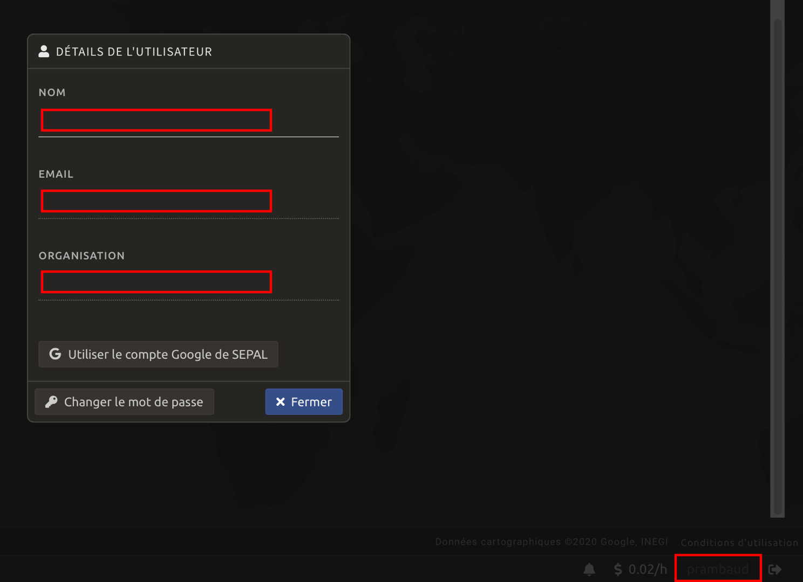
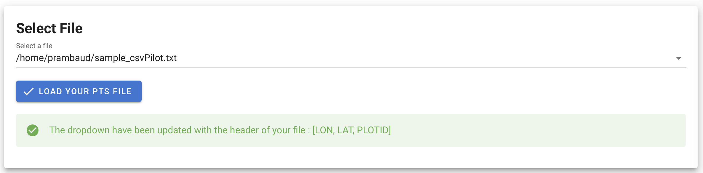
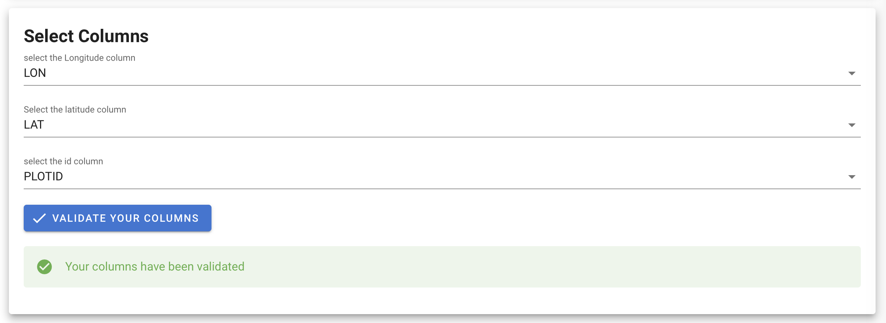
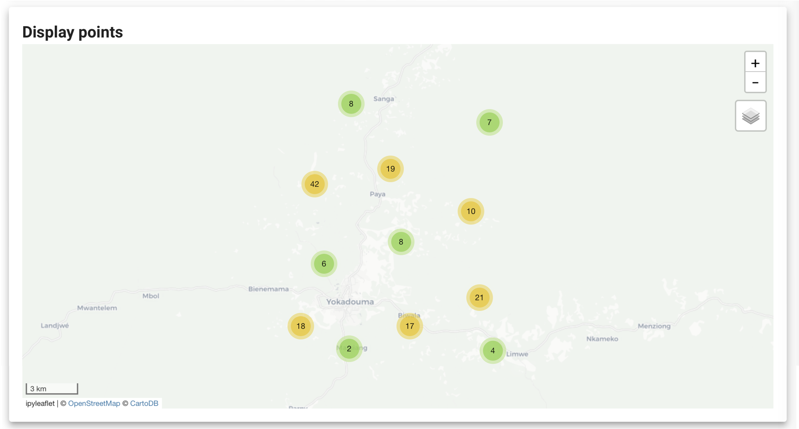
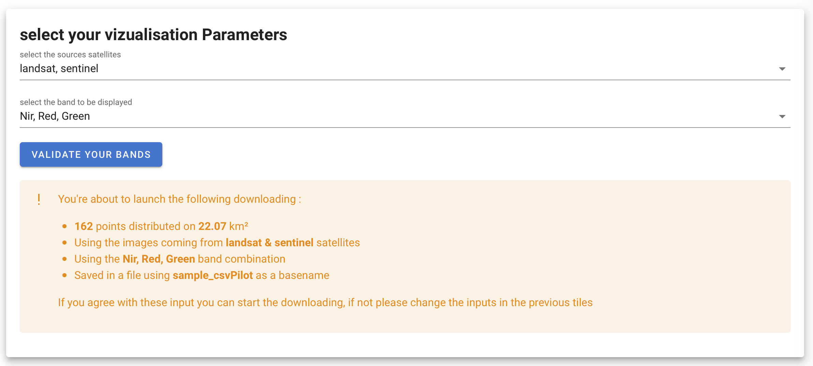
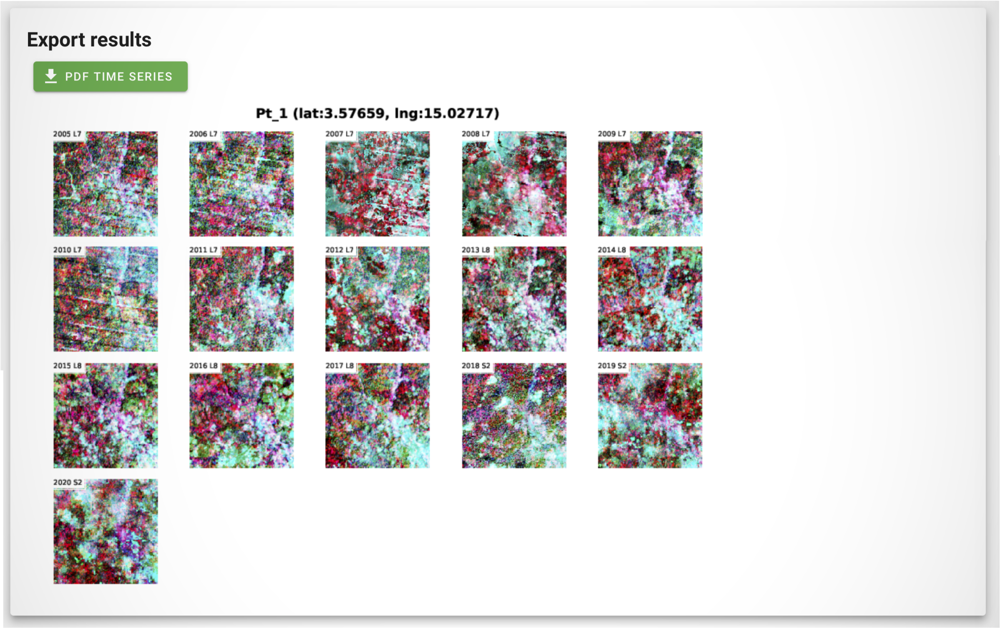

# Welcome in the user documentation 

This documentation should explain every step to execute the module. If any question or bug remains, please consider post it on the [bug report page](https://github.com/12rambau/gfc_wrapper_python/issues)

## Before starting 
This module will require the user to register to GEE instead of using the public SEPAL account. Follow this [link](https://earthengine.google.com) to create a GEE account. Once done, select your GEE account in the SEPAL bottom right corner and use your personal credentials. 



Then go to your terminal, start a `t1` session and run:  
```
$ earthengine authenticate
```

Follow the instructions provided by the command. You are now ready to go.

## table of content
1. [select file](#)  
2. [select time serie parameters](#) 
3. [export data](#)  


> :warning: **Troubleshooting:** This module is executed through a voila application that create a User Interface on top of a Jupyter notebook. The reactivity of some components will thus be a little slower than what you are used to on a standard website. Please be nice with them.


## 1. Select file 

First the user need to select a file in the available .txt of its sepal env using the dropdown of the first tile. The Alert will display the identified columns name and update the following dropdowns.



In the following tile You'll be asked to select the X (longitude) and the Y (latitude) column name in your file. The Id column will be used to name the points in the final pdf

> if you use names for `id` make sure that they are all differents. 



The map will be updated with the selected points



## 2. select time serie parameters

In this second step, the user is asked to select the band combination he wants to display as well as the satelites he wants to use. 

When you click on the validation button, the module gives you a sum up of the download your about to perform. It's a warning step to avoid the download of huge number of points. 

> If you only select sentinel, no images will be available before 2012. 



## 3. export data

Only one single button here. 
Click on it and the downloading of your images will be send to earthengine. 

When the alert start to display "STATUS: RUNNING" it means that all the orders have been send to GEE. Then you can close your sepal page and wait for the process to complete in the [earthengine code editor task list](https://code.earthengine.google.com/#). When all the images are downloaded, yuo can start the module again, use the same parameters and the module will retrieve them from your gdrive. 

> If you go back to the module BEFORE the end of the downloading, the module will restart the order all over again

> The images will be removed from your gdrive after the creation of the pdf to save space

Then the module will give you a clickable link in the green button and a preview of the first page of the pdf

